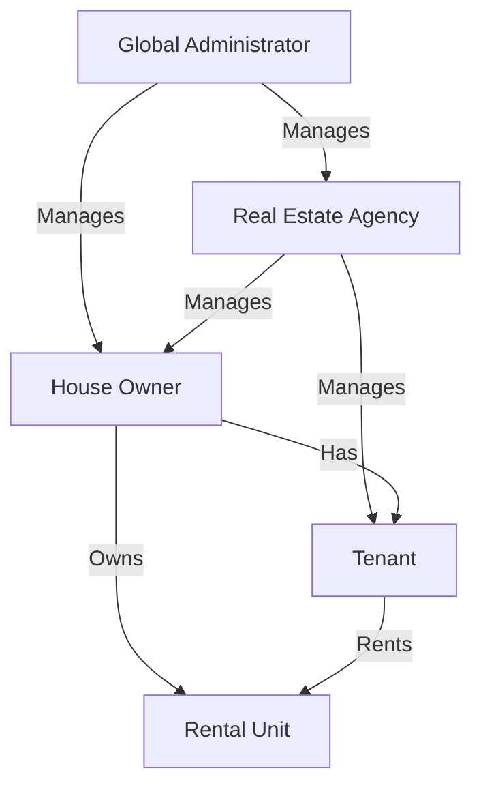
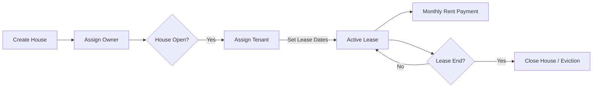
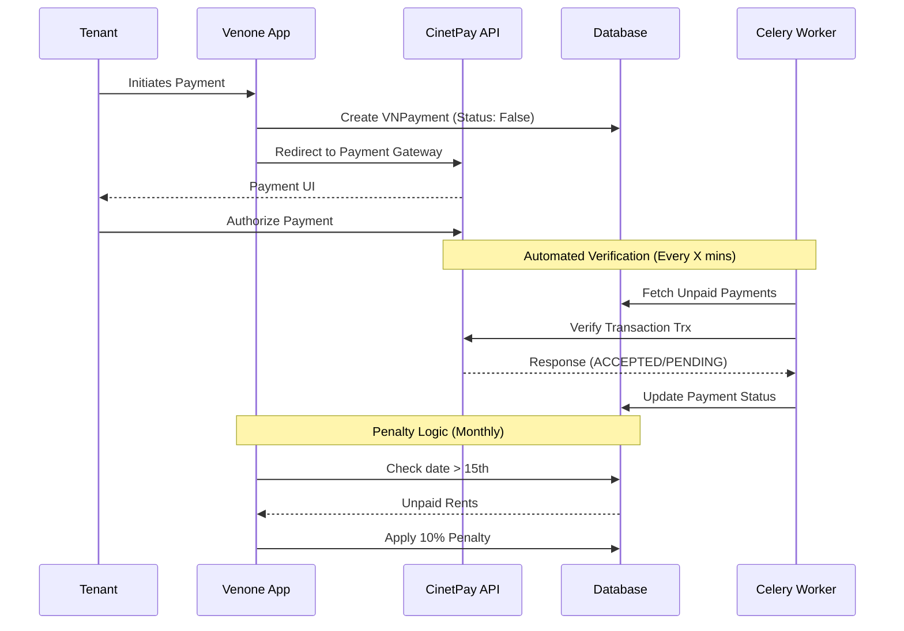
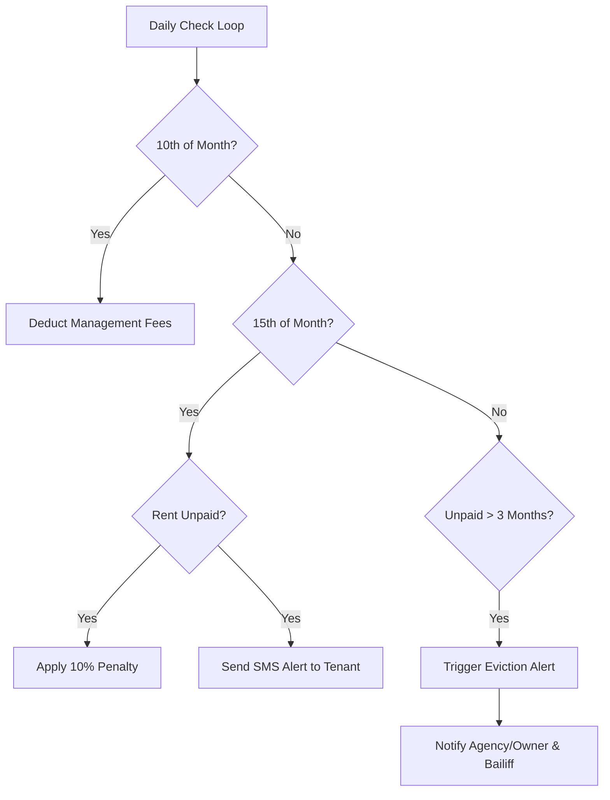

# PROPERTY MANAGEMENT APPLICATION

[](https://flask.palletsprojects.com/)
[](https://www.python.org/)
[](https://opensource.org/licenses/MIT)

## Description

Venone CRM is a professional property management application designed for real estate agencies, landlords,
and administrators. It facilitates rental management, payment tracking, and automated alerts via SMS and email.

## Key Features

- **Real Estate Management**: Specialized interfaces for agencies and landlords.
- **Rental Tracking**: Management of rental units, tenant assignments, and contracts.
- **Payment System**: Recording deposits, advances, and rental payments.
- **Automated Fees**: Automatic deduction of management fees on the 10th of each month.
- **Penalty System**: Automatic 10% penalty for payments made after the 15th.
- **Smart Alerts**: SMS and software alerts for payment arrears and eviction notices (after 3 months).
- **Communication**: Automated SMS notifications to tenants.

## Tech Stack

- **Backend**: Flask 2.x, Python 3.10
- **Database**: SQLAlchemy (PostgreSQL in production, SQLite for dev)
- **Task Queue**: Celery with Redis for background processing
- **Authentication**: Flask-Login and Flask-Bcrypt
- **Frontend**: Jinja2 Templates, Vanilla CSS, and JavaScript
- **API**: REST API with Marshmallow serialization

## Project Structure

```text
venone-crm/
├── src/                # Core application source
│   ├── api/            # REST API implementation
│   ├── auth/           # Authentication and User logic
│   ├── dashboard/      # Admin, Agency, and Owner dashboards
│   ├── payment/        # Payment processing
│   ├── tenant/         # Property and Tenant management
│   ├── templates/      # Jinja2 HTML templates
│   └── static/         # Frontend assets (CSS, JS)
├── config.py           # Configuration management
├── runserver.py        # CLI application entry point
└── Pipfile             # Dependency management
```

### Docker Compose (Recommended)

If you have Docker and Docker Compose installed, you can start the entire stack with a single command:

```bash
docker compose up -d --build
```

This will:
- Build the optimized image using the multi-stage Dockerfile.
- Load environment variables from your `.env` file.
- Expose the application on `http://localhost:5000`.
- Monitor the health of the application.

To create the initial administrator:
```bash
docker compose exec app flask create-admin
```

### Manual Installation

1. **Clone the repository**:
   ```bash
   git clone <repository-url>
   cd venone-crm
   ```

2. **Install dependencies**:
   Ensure you have `pipenv` installed.
   ```bash
   pipenv install
   ```

3. **Configure Environment**:
   Copy `.env.example` to `.env` and fill in the required variables (Database, SMS API, etc.).
   ```bash
   cp .env.example .env
   ```

7. **Initialize Database**:
   ```bash
   pipenv run flask init-db
   ```

8. **Create Admin User**:
   ```bash
   pipenv run flask create-admin
   ```

9. **Run the application**:
   ```bash
   pipenv run python runserver.py
   ```

## Development

- **Migrations**: Use `flask db migrate` and `flask db upgrade` to manage database changes.
- **Task Worker**: Start Celery with `celery -A src.venone.celery worker`.

## Maintenance & Database

### Emptying/Resetting the Database

**Option 1: Flask CLI (Recommended for data only)**
To drop all tables and start fresh:
```bash
# Full reset (migrations + roles)
pipenv run flask init-db

# Update roles only
pipenv run flask init-roles

# Purge tables
pipenv run flask drop-db
```

**Option 2: Docker Compose (Nuclear reset)**
To completely delete the database and its volumes:
```bash
docker compose down -v
docker compose up -d --build
```

**Option 3: Manual (SQLite only)**
Delete the local database file:
```bash
rm dev.sqlite3
```

### Seeding Test Data

To populate the database with realistic test data for development:

**Option 1: Local**
```bash
pipenv run flask seed-db --count 5
```

**Option 2: Docker**
```bash
docker compose exec app flask seed-db --count 5
```
*Note: This command currently expects `faker` to be installed in the environment.*

### CLI Management (Summary)

| Category | Shortcut (Local) | Shortcut (Docker) | Flask Command (pipenv run flask ...) |
|----------|------------------|-------------------|--------------------------------------|
| Init     | `make db-init`   | `make dk-init`    | `init-db`                            |
| Roles    | `make db-roles`  | `make dk-roles`   | `init-roles`                         |
| Admin    | `make admin`     | `make dk-admin`   | `create-admin`                       |
| Purge    | `make db-drop`   | `make dk-drop`    | `drop-db`                            |
| Seed     | `make db-seed`   | `make dk-seed`    | `seed-db`                            |

---

## Core Workflows

### 1. User & Role Hierarchy



### 2. Rental Lifecycle



### 3. Payment & Automation Flow



### 4. Alert System Logic



## Credit

Developed by [flavien-hugs](https://twitter.com/flavien_hugs)
