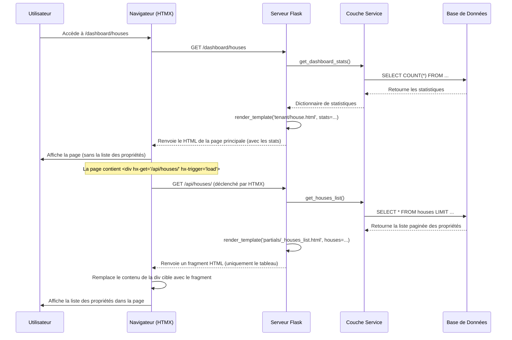

# Venone CRM

Venone CRM est une application de gestion de la relation client (CRM) conçue pour le secteur immobilier. Elle permet aux propriétaires et aux agences de gérer leurs
propriétés, locataires, paiements et communications de manière efficace.

## Fonctionnalités Principales

- **Gestion des Rôles** : Système de permissions basé sur les rôles (Administrateur, Staff).
- **Gestion Immobilière** : Suivi des propriétés, de leur disponibilité et des baux.
- **Gestion des Tiers** : Gestion des informations sur les propriétaires (`HouseOwner`) et les locataires (`Tenant`).
- **Suivi des Paiements** : Enregistrement et vérification des paiements de loyer.
- **Tableau de Bord Analytique** : Visualisation des statistiques clés (revenus, taux d'occupation, etc.) via des graphiques.
- **Tâches Asynchrones** : Utilisation de Celery pour les tâches de fond comme l'envoi de rappels de paiement.
- **Export de Données** : Génération de fichiers CSV pour les locataires, propriétaires, et autres données.

## Architecture du Projet

Le projet est structuré selon une **architecture en couches**, ce qui favorise la séparation des préoccupations et la maintenabilité.

- **Couche Présentation** : Gérée par Flask et les templates Jinja2. HTMX est utilisé pour les mises à jour dynamiques
de l'interface, offrant une expérience utilisateur réactive sans nécessiter un framework JavaScript lourd.
- **Couche Application (Services)** : Contient la logique métier de l'application, orchestrant les opérations entre le
domaine et l'infrastructure.
- **Couche Domaine** : Définit les objets et les règles métier principaux de manière agnostique par rapport à la technologie.
- **Couche Infrastructure** : Gère les détails techniques comme la base de données (SQLAlchemy), les services externes
    (CinetPay, SMS), la mise en cache et les tâches de fond (Celery).

## Diagramme de Flux (Exemple : Chargement de Page)

Le diagramme ci-dessous illustre le flux de données lors du chargement d'une page de liste, comme le tableau de bord des
propriétés.


```mermaid
sequenceDiagram
    participant User as Utilisateur
    participant Browser as Navigateur (HTMX)
    participant Flask as Serveur Flask
    participant Services as Couche Service
    participant Database as Base de Données

    User->>Browser: Accède à /dashboard/houses
    Browser->>Flask: GET /dashboard/houses
    Flask->>Services: get_dashboard_stats()
    Services->>Database: SELECT COUNT(*) FROM ...
    Database-->>Services: Retourne les statistiques
    Services-->>Flask: Dictionnaire de statistiques
    Flask->>Flask: render_template('tenant/house.html', stats=...)
    Flask-->>Browser: Renvoie le HTML de la page principale (avec les stats)
    Browser->>User: Affiche la page (sans la liste des propriétés)

    Note over Browser: La page contient <div hx-get="/api/houses/" hx-trigger="load">
    Browser->>Flask: GET /api/houses/ (déclenché par HTMX)
    Flask->>Services: get_houses_list()
    Services->>Database: SELECT * FROM houses LIMIT ...
    Database-->>Services: Retourne la liste paginée des propriétés
    Flask->>Flask: render_template('partials/_houses_list.html', houses=...)
    Flask-->>Browser: Renvoie un fragment HTML (uniquement le tableau)
    Browser->>Browser: Remplace le contenu de la div cible avec le fragment
    Browser->>User: Affiche la liste des propriétés dans la page
```

## Stack Technologique

- **Backend**: Python 3.10, Flask
- **Base de données**: PostgreSQL
- **ORM**: SQLAlchemy, Flask-SQLAlchemy
- **Migrations**: Alembic, Flask-Migrate
- **Frontend**: Jinja2, HTMX, Bootstrap, Chart.js
- **Tâches Asynchrones**: Celery, Redis
- **Gestion des Dépendances**: Pipenv
- **Conteneurisation**: Docker, Docker Compose
- **Linting & Formatage**: Flake8, Black

## Installation et Lancement

### 1. Configuration Locale

**Prérequis**: Python 3.10, Pipenv.

1.  **Clonez le dépôt** :
    ```bash
    git clone <url-du-repo>
    cd venone-crm
    ```

2.  **Créez un fichier `.env`** à partir de l'exemple et configurez vos variables d'environnement (base de données,
clés API, etc.).

3.  **Installez les dépendances** :
    ```bash
    pipenv install --dev
    ```

4.  **Activez l'environnement virtuel** :
    ```bash
    pipenv shell
    ```

5.  **Initialisez la base de données** (la première fois uniquement) :
    ```bash
    flask init-db
    ```

6.  **Créez un compte administrateur** :
    ```bash
    flask create-admin
    ```

7.  **Lancez l'application** :
    ```bash
    flask run
    ```

### 2. Lancement avec Docker

**Prérequis**: Docker et Docker Compose.

1.  Assurez-vous d'avoir un fichier `.env` configuré à la racine du projet.

2.  **Construisez et lancez les conteneurs** :
    ```bash
    docker-compose up --build
    ```

L'application sera accessible sur `http://localhost:5000`.

## Structure du Projet

```
.
├── Dockerfile
├── Pipfile
├── Pipfile.lock
├── compose.yml
└── src
    ├── api/          # Points d'entrée de l'API et routes web (HTMX)
    ├── cli.py        # Point d'entrée de l'application Flask
    ├── core/         # Logique métier et domaine
    │   ├── domain/
    │   ├── interfaces/
    │   ├── mappers/
    │   ├── repositories/
    │   └── services/
    ├── dashboard/    # Blueprints pour les vues du tableau de bord
    ├── infrastructure/
    │   ├── config/
    │   ├── external/ # Services tiers (SMS, Paiement)
    │   ├── persistence/ # Modèles SQLAlchemy, seeders
    │   └── tasks/    # Tâches Celery
    ├── static/       # Fichiers statiques (CSS, JS, images)
    └── templates/    # Templates Jinja2
```
